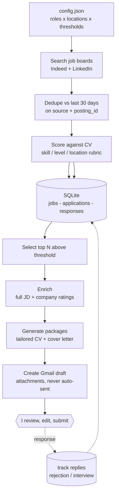

# Job-search pipeline — a case study

An automated, daily pipeline that searches UK job boards, scores every posting against my CV,
drafts tailored applications, and tracks responses — with a human approving before anything is
sent. Built to run my own job hunt; presented here as a data-engineering case study.

> **Scale to date:** **658 postings** ingested and scored (634 Indeed, 24 LinkedIn) ·
> ~150 cleared the fit threshold · **0 auto-submitted, by design.**
>
> This repo is the **sanitised case study** — architecture, data model, scoring design, and the
> deterministic data layer. The live system is private (it holds my CV, email, and API
> credentials).

---

## The problem

Job hunting is a repetitive data problem: the same boards, the same searches, the same triage
of "is this worth my time?" every single day. I automated the boring 90% — search, dedupe,
score, draft — and kept a human (me) in charge of the 10% that matters: deciding what to send.

## Architecture



## How it works, stage by stage

| Stage | What happens | Engineering point |
|------|--------------|-------------------|
| **1. Configure** | One `config.json` holds every search query, location, and threshold | Behaviour is data, not hard-code — tune without touching logic |
| **2. Search** | Fan out queries across a role × location matrix, in parallel | Many calls per run; failures are logged and skipped, never fatal |
| **3. Dedupe** | Drop anything seen in the last 30 days (`source` + `posting_id`) | Idempotent — re-running never floods me with repeats |
| **4. Score** | Each posting scored 0–100 vs my CV on a fixed rubric | Consistent, explainable triage with a one-line reason |
| **5. Store** | Upsert into SQLite with `INSERT OR IGNORE` on a unique key | Safe writes; the DB is the single source of truth |
| **6. Select & enrich** | Take top N above threshold; pull full JD + company ratings | Spend expensive lookups only on the shortlist |
| **7. Package** | Auto-generate a tailored CV + cover letter per strong match | The tedious bit, automated |
| **8. Draft** | Build a Gmail draft with attachments — **never sends** | Human-in-the-loop is a deliberate safety boundary |
| **9. Track** | Parse inbound replies, label them, link to the application | Closes the loop: outcomes feed back into the data |

## Data model

Three normalised tables ([`schema.sql`](schema.sql)): `jobs` (ingested + scored postings),
`applications` (packages generated from a job), and `responses` (inbound email, linked by foreign
key to an application). The `UNIQUE(source, posting_id)` constraint is what makes ingestion
idempotent.

## The scoring design

The triage rubric is the heart of the system — a weighted score with honest gates:

- **Skill match (40%)** — resume skills present in the JD; *deductions* for required tools I lack
  (Spark, Snowflake, etc.) so the model can't reward a bad fit.
- **Level fit (40%)** — calibrated to my real experience (junior/graduate band scores high; senior
  and lead roles are scored down, not surfaced).
- **Location/workplace (20%)** — remote-UK and hybrid favoured; non-UK roles without UK/EMEA
  eligibility zeroed out.
- **Penalties & bonuses** — stale postings, adjacent roles (data engineering ≠ data science),
  vague-agency listings; bonuses for reputable named employers.

Every posting gets a one-sentence `score_reason` — the honest five-second pitch — so the triage
is auditable, not a black box.

## What I'd improve next

- Replace the rule-based scorer with a small **learned ranker** trained on which roles I actually
  applied to (the `applications` table is the label source).
- Add a **response-rate dashboard** — application → reply funnel by role, company, and score band.
- Schedule it as a proper cron service with run metrics, instead of on-demand.

## Tech & orchestration

`Python` · `SQLite` · job-board APIs (MCP) · `Gmail API` · `python-docx` for CV/letter generation.
Orchestrated as **Claude Code agent skills** — the deterministic data layer (this repo) is plain
Python; the search and CV-scoring steps are driven by an LLM agent against live tools. It's an
*agent-orchestrated pipeline*, and I'm happy to walk through exactly which parts are deterministic
versus model-driven.

## Run the data layer

```bash
python src/pipeline_core.py
```
A self-contained demo: builds the schema in memory, ingests sample postings, proves the dedupe is
idempotent, and prints the ranked shortlist.

---

*Privacy: the live pipeline processes my own personal data only and never auto-submits
applications. This repository contains no personal data, credentials, or scraped content.*
